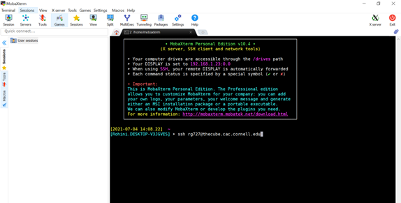

# Cluster Basics 

## Gaining access to Hopper and the Cube 

## The Cube 
The Cube is the personal cluster associated with the Reed Research Group. Any student in Reed Group will be provided access to the Cube and collaborators can request a guest access. In order to get access, email Pat and provide your name, email, address, and phone number so that he can register you as a user. You will get an email with your login information and a notice to set a password. 

Specs on the Cube: https://www.cac.cornell.edu/wiki/index.php?title=THECUBE_Cluster

## Hopper
Hopper is a newer cluster that is headed by the Srikrishnan Group in BEE and is shared across four groups: Srikrishnan, Steinschneider, Reed, and Anderson. Any student in Reed Group will also be allowed access to Hopper. In order to get access, email Vivek Srikrishnan and provide your name, email, address, and phone number so that he can register you as a user. You will get an email with your login information and a notice to set a password. 

Specs on Hopper: https://www.cac.cornell.edu/wiki/index.php?title=Hopper_Cluster
  

## Accessing the Cluster
In order to access the cluster, which is housed and maintained by Cornell University Center for Advanced Computing (CAC), you will have to connect remotely using SSH.

### Windows

The easiest way to remote into the above clusters if you are a Windows user is to download MobaXterm here: https://mobaxterm.mobatek.net/. Start the local terminal and then ssh into the terminal as in the following image, but using you own username. 

MobaXterm allows you to see the file structure in the left hand side SFTP which is convenient for navigating.  

### Mac

If you use a Mac, you can immediately ssh into the clusters without having to download MobaXterm since Macs have Terminal. However, you may find that it's harder to navigate just using the command line. Students who use Macs in our group have had success pairing their terminal use with Cyberduck (https://cyberduck.io/) which can serve as the SFTP. 

## Questions
If you have questions about installing packages on the cluster or questions about jobs, feel free to email: cac-help@cornell.edu 
