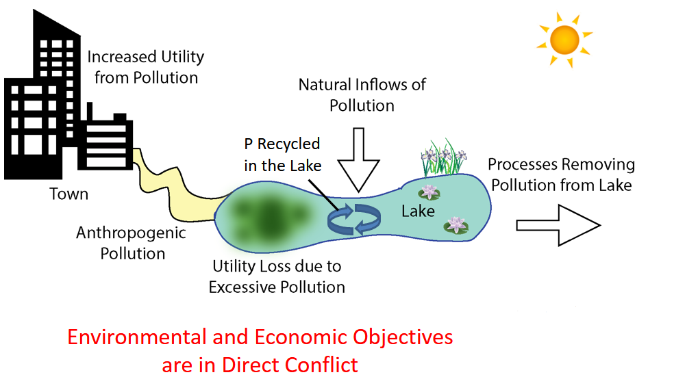

# The Shallow Lake Problem

## Background
*Placeholder from Julie's paper*

Managing socio-ecological systems is a challenge wrought by competing societal objectives, deep uncertainties, and potentially irreversible tipping points. A classic, didactic example is the shallow lake problem in which a hypothetical town situated on a lake must develop pollution control strategies to maximize its economic benefits while minimizing the probability of the lake crossing a critical phosphorus (P) threshold, above which it irreversibly transitions into a eutrophic state. Here, you'll explore two optimization strategies to design robust pollution control rules for the town that account for deeply uncertain system characteristics and conflicting objectives. 

| Week  | Topic                                                                   | Readings                                                | Software Exercises                                                                                   |
|-------|-------------------------------------------------------------------------|---------------------------------------------------------|------------------------------------------------------------------------------------------------------|
|     1 | Intro to the Lake Problem model                                         | Carpenter et al   1999                                  |     Python practice – recreate Figure 1 in Quinn et al                                               |
| 2     | Formulating the problem and understanding the mathematics behind it     | Ward et al 2015                                         |     lakeModelInPython.py and model.py software review/testing in Rhodium                             |
|     3 | Intertemporal open loop control algorithm basics                        | Hadka et al 2015 Ward et al 2015                        |                                                                                                      |
|     4 | Direct policy search closed loop implementation                         | Guiliani et al., 2016   Koutsoyiannis & Economu 2003    |                                                                                                      |
|     5 | MOEAs and Borg                                                          | Reed et al 2012  Hadka & Reed 2013                      |     [Install and learn basics of BORG MOEA](http://borgmoea.org/#about-us)                            |
|     6 | MOEA diagnostics                                                        | Zitzler et al 2003                                      |                                                                                                      |
|     7 | Evaluating robustness                                                   | Herman et al 2015                                       |     [Blog example](https://waterprogramming.wordpress.com/2019/06/27/examining-robustness-metrics-using-rhodium/)    |
|     8 |     Sensitivity analysis and scenario discovery                         | Bryant & Lempert 2010                                   |     Run test_prim.py                                       |
