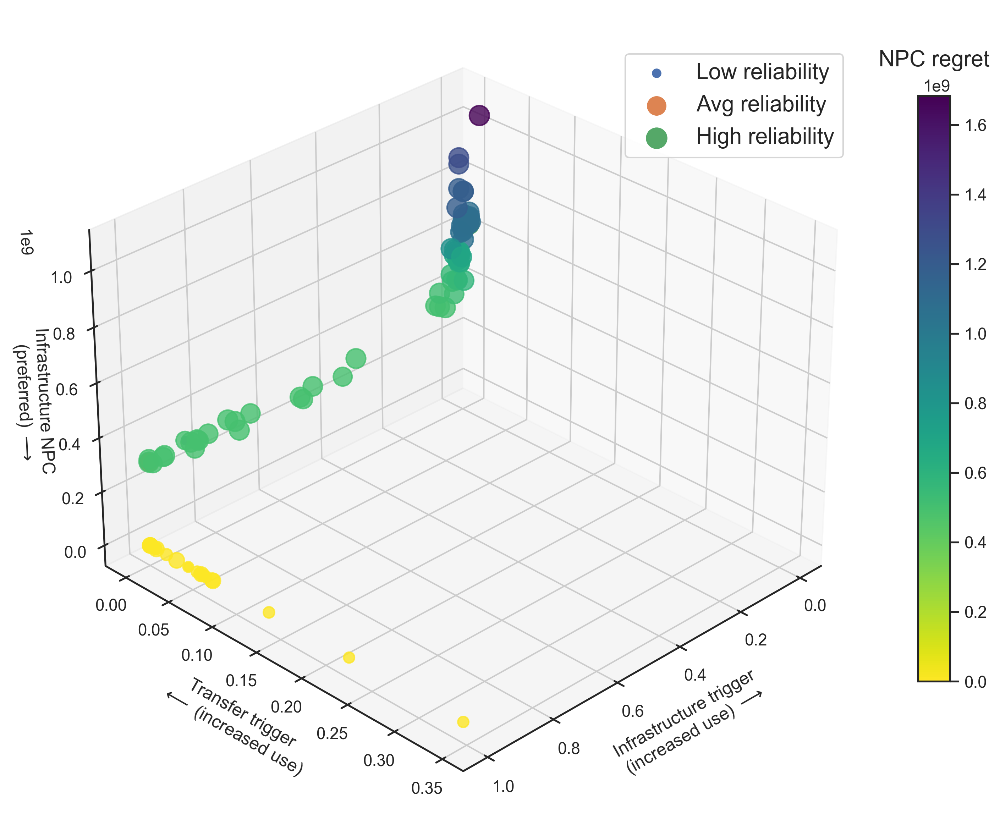

# Three-dimensional scatter plots, playing with point size, and positioning legends

Another way to represent high-dimensional data is using a three-dimensional plot (any more axes is just showing off and/or unecessary visual load). Additional dimensions can be visualized using other techniques such as playing with point color and point size. It is also important that your audience knows that they are looking at, which is why we will also look into legend placement. Therefore, this resource provides information on three fronts:

1. Learning to plot a three-dimensional scatter plot
2. Varying and scaling point size according to data values
3. Customizing and positioning a legend 

To begin, let's first load all required librairies.

```python
# import libraries
import numpy as np
import pandas as pd
import matplotlib.pyplot as plt
import matplotlib as mpl
import seaborn as sns

# set the figure background format
sns.set_theme(style="white")
```

Nice work! Now, use the `pd.read_csv()` function to read in our dataset, `scatter3d.csv`. This dataset contains five variables:
1. A water utility's infrastructure trigger (`inf_trigger`, or how often it is constructing new infrastructure). More information on these triggers can be found [here](https://waterprogramming.wordpress.com/2021/04/26/mordm-basics-iii-rof-triggers-and-performance-objective-tradeoffs/).
2. A water utility's transfer trigger (`tt_trigger`) that dictates how often it requests for water transfers from its partners (not shown in this dataset).
3. A water utility's infrastructure NPC (`INPC`)
4. A water utility's supply reliability (`REL`)
5. The infrastructure NPC's regret measure (`INPC_regret`, more on that [here](https://waterprogramming.wordpress.com/2019/06/27/examining-robustness-metrics-using-rhodium/)). 

Let's load it in!

```python
# import data
df_scatter = pd.read_csv("scatter3d.csv", index_col=0)

# extract the data to plot
inf_trigger = df_scatter['inf_trigger']
tt_trigger = df_scatter['tt_trigger']
INPC = df_scatter['INPC']
REL = df_scatter['REL']
INPC_regret = df_scatter['INPC_regret']

```

We will also use a function to normalize our point colors for us. More information on this can be found [here](scatterplot_colorbar.md)

```python
def normalize_regret(regret_df):
    regret_norm = (regret_df-regret_df.mean())/regret_df.std()
    return regret_norm
```

We will plot `inf_trigger` against `tt_trigger` and `INPC`. We will use normalized `INPC_regret` to color the points, and a scaled `REL` for the point sizes. To begin, we iniatilize a 3D scatter plot object. 

```python 
# Create a 3D subplot
fig3d = plt.figure(figsize=(10, 10))
ax3d = fig3d.add_subplot(111, projection='3d')

```

Now we create the 3D scatter plot.

```python
# Create the scatter plot
ax3d.scatter(inf_trigger, tt_trigger, INPC, c=normalize_regret(INPC_regret), cmap='viridis_r', \
             s=REL*200, alpha=0.8)

# Set labels for the three axes
ax3d.set_xlabel('Infrastructure trigger\n(increased use) $\longrightarrow$', labelpad=10)
ax3d.set_ylabel('Transfer trigger\n$\longleftarrow$ (increased use)', labelpad=10)
ax3d.set_zlabel('Infrastructure NPC\n(preferred) $\longrightarrow$')

ax3d.view_init(elev=30, azim=45)  # Set elevation and azimuth angles

```

The last line of code here is important: by varying the values of the `azim` parameter, you will be able to view the 3D plot from different angles. 

Note that `s=REL*200`. This is scaling the `REL` values up by a factor of 200, since these values (as they are) are between the values of 0-1. Points of these sizes will be nearly invisible on the plot; we need scale them up so they are visible on the 3D plot. Feel free to experiment with different scaling factors!

Once we create the plot itself, we will make the colorbar to show how the utility's infrastructure NPC regret, `NPC_regret`, varies with the three values on the axes. Take a look at [this page on the Lab Manual](scatterplot_colorbar.md) for more details on color bars, and how to make them. For now, let's just make one:

```python
# Create the color bar
# the darker the color, the higher the regret
norm3d = plt.Normalize(INPC_regret.min(), INPC_regret.max())
cax3d = fig3d.add_axes([0.95, 0.25, 0.03, 0.55])  # [left, bottom, width, height]
cax3d.set_title('NPC regret', pad=20, fontsize=15)
cbar3d = fig3d.colorbar(mpl.cm.ScalarMappable(norm=norm3d, cmap='viridis_r'), cax=cax3d, orientation='vertical')

```

Next, let's create the legend for this plot:

```python
# create legend for scatter sizes
ax3d.scatter(inf_trigger.iloc[0], tt_trigger.iloc[0], INPC.iloc[0], \
             s=REL.min()*200, label='Low reliability')
ax3d.scatter(inf_trigger.iloc[1],tt_trigger.iloc[1], INPC.iloc[1], \
            s=REL.mean()*200, label='Avg reliability')
ax3d.scatter(inf_trigger.iloc[2], tt_trigger.iloc[2], INPC.iloc[2], \
            s=REL.max()*200, label='High reliability')

ax3d.legend(loc='upper right', bbox_to_anchor=(1,0.96), scatterpoints=1, ncol=1, fontsize=15)
plt.savefig('scatter3d.png', dpi=300, bbox_inches='tight')
plt.show()

```

The code above is creating three additional plots so that, when the legends are created, it identifies three unique labels. Here, we want to show the difference in sizes between points that represent low, average, and high reliability. Next, we call the `legend()` function to display the legend. Here is what each of its parameters are doing: 
1. `loc` tells the function where the legend should be placed within the figure 
2. `bbox_to_anchor` identifies where the center of the legend should be placed in the figure relative to its main location
3. `scatterpoints` is how you tell the function how many points you would like to displat as part of the legend
4. `ncol` identifies how each of your labels should be stacked; play around with this value to see how your legend changes
5.  `fontsize` controls the size of your legend labels

Further information can be found [here](https://matplotlib.org/stable/api/_as_gen/matplotlib.pyplot.legend.html).

If the code ran successfully, you should be able to display and save the following figure:



Nicely done! 