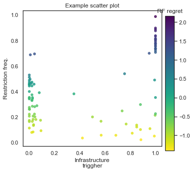

# Scatter plots and colorbars using Matplotlib

When representing high-dimensional data, color variation and/or gradation is a useful tool to help better visualize how different variables relate to one another. This is a demonstration on how to create a two-dimensional scatter plot where the color of each point represents a third variable. We will learn how to create, position, and show a colorbar that reflects the color gradient of the points. 

First, let's load all required librairies.
```python
# import libraries
import numpy as np
import pandas as pd
import matplotlib.pyplot as plt
import matplotlib as mpl
import seaborn as sns

# set the figure background format
sns.set_theme(style="white")
```

Nice work! Now, let's use the `pd.read_csv()` function to read in our dataset, `scatter_colorbar.csv`. This dataset contains three variables:
1. A water utility's water-use restriction frequency (`RF`)
2. Its infrastructure trigger (`inf_trigger`, or how often it is constructing new infrastructure). More information on these triggers can be found [here](https://waterprogramming.wordpress.com/2021/04/26/mordm-basics-iii-rof-triggers-and-performance-objective-tradeoffs/).
3. Each restriction frequency's regret measure (`RF_regret`, more on that [here](https://waterprogramming.wordpress.com/2019/06/27/examining-robustness-metrics-using-rhodium/)). 

```python
# import data
df_scatter = pd.read_csv("scatter_colorbar.csv", index_col=0)

# extract the data to plot
RF = df_scatter['RF']
inf_trigger = df_scatter['inf_trigger']
RF_regret = df_scatter['RF_regret']
```

Before we plot any colors, its generally good practice to normalize the values of the variable we would like to plot as the color. Let's make a function that will automate this for us:

```python
def normalize_regret(regret_df):
    regret_norm = (regret_df-regret_df.mean())/regret_df.std()
    return regret_norm
```

We will plot `RF` against `inf_trigger`, and use normalized `RF_regret` to color the points. Let's begin!

```python
# Make the figure and subplot
# set the figure size
fig, ax = plt.subplots(1, 1, figsize=(5, 5))

# plot the data using the reversed viridis colormap
ax.scatter(inf_trigger, RF,  c=normalize_regret(RF_regret), cmap='viridis_r', s=20, alpha=0.8)
ax.set_xlabel("Infrastructure\ntriggher")
ax.set_ylabel("Restriction freq.")
ax.set_title("Example scatter plot")

# Create the color bar
# the darker the color, the higher the regret
norm = plt.Normalize(normalize_regret(RF_regret).min(), normalize_regret(RF_regret).max())
cax = fig.add_axes([0.92, 0.1, 0.05, 0.75])  # [left, bottom, width 5% of figure width, height 75% of figure height]
cax.set_title('RF regret')
cbar = fig.colorbar(mpl.cm.ScalarMappable(norm=norm, cmap='viridis_r'), cax=cax, orientation='vertical')

plt.show()
```

Whoa, what just went down here? Let's walk through this.

1. First, we created a figure and its child subplot that will host our data points.

2. Next, we created the scatter plot and told it to color it using the `viridis_r` colormap, which is the reversed version of the basic `viridis` colormap, which colors higher values a lighter color. In our case, we would like higher regret to be represented using darker colors. Thus, we append the `_r` suffix to the colormap name. This will generally apply to all Matplotlib colormaps. You can find an exhaustive list of all named colormaps available in Matplotlib [here](https://matplotlib.org/stable/tutorials/colors/colormaps.html).

3. We then formatted the scatter plot with axis and plot labels. 

4. Then, we created the color bar. 
    - The `norm` variable creates a `plt.Normalize` Matplotlib object that takes a (min, max) range and converts it into a range of colors.
    - The `cax` is an additional axis that is placed at 92% of the width and 10% from the bottom of the figure. It has dimensions of 5% of the figure width, and 75% of the figure height. 
    - We named this colorbar 'RF regret'.
    - And then we placed the colorbar into the figure at position `cax` with a vertical orientation. The first argument into the `colorbar` function, `mpl.cm.ScalarMappable(norm=norm, cmap='viridis_r')` ensures that the color gradient in the colorbar is appropriate according to the values of `RF_regret` and uses the `viridis_r` colormap.

If the code ran successfully, you should be able to display and save the following figure:


Great work!