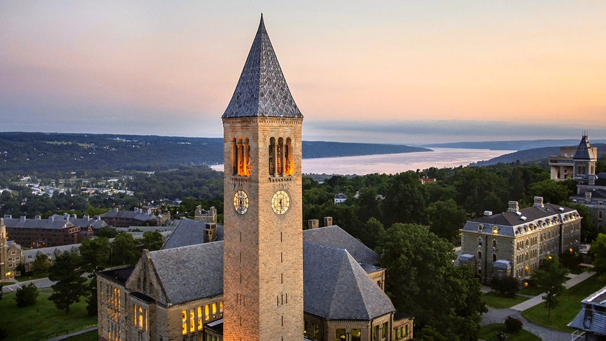
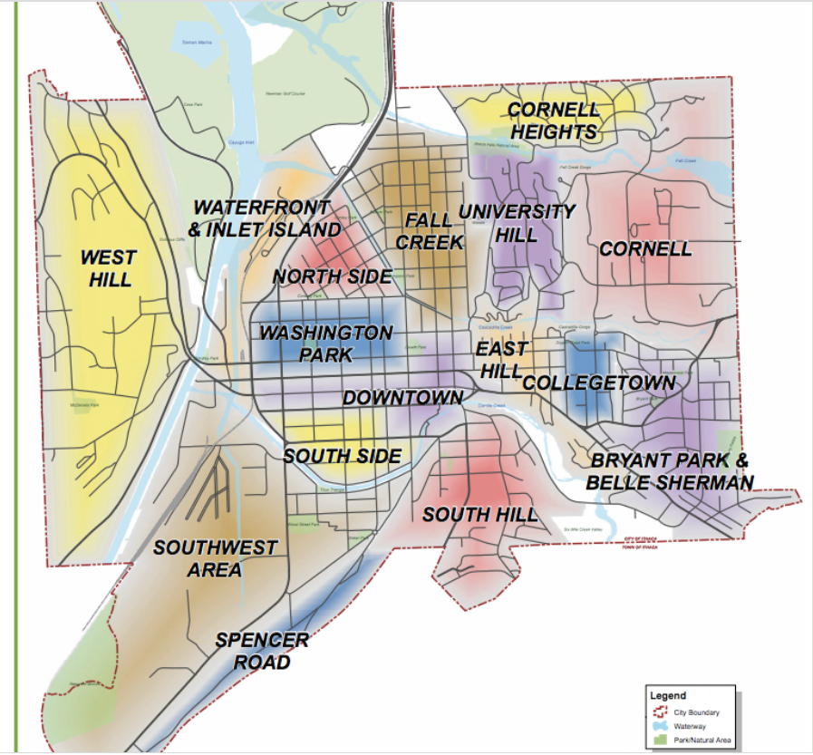

# Housing Around Cornell 

## When and Where to Look for Housing 
March/April is ideal time to find a lease that begins in August, though there are usually a few places still available in June/July. Common places for looking for apartments include the Cornell University Housing, Sublets, and Roommates Facebook Group, Craigslist, and Apartments.com

## Ithaca Neighborhoods 

It helps to describe Ithaca’s geography a bit. Ithaca is surrounded by three hills and a lake (to the north). Cornell is on the east hill, Ithaca College on the south hill. Downtown is situated in the middle of the hills. Around Ithaca are a variety of neighborhoods that students can live in. 

### Collegetown
Collegetown is the closest neighborhood to Cornell and within walking distance to Hollister Hall. In terms of amenities, Collegetown has many restaurants, a 7/11, a UPS store, a branch of the local GreenStar Co-Op and some other smaller convenience stores. It’s a popular location for undergrads to live and tends to have more of a vibrant/party atmosphere. Collegetown has both apartment-style living and houses. 

### Fall Creek
Fall Creek is one of the most beloved neighborhoods in Ithaca and a popular place for graduate students to live. Housing is primarily comprised of homes (of various shapes, sizes, and colors) that graduate students share. It is down the hill from Cornell and so students often take buses (about a 15-minute ride from Hollister). At the bus stop on Linn Street you can also access the Cascadilla Gorge Trail. Walking up these steps is a fun activity for the summer that can take about 30 minutes but leads you very close to Hollister. The Commons, which has restaurants/live music/small shops is within a 5-10 minute walk from Fall Creek. The downtown branch of GreenStar Co-Op is within walking distance, but a bus or a car will be required to access Wegmans/Trader Joes/stores on Meadow Street. Buses: 10/30/32; about a 10-15 minute bus ride. 

### East Hill
East Hill can be anywhere from a 15-30 minute walk from Engineering Quad and about a 15 minute bus ride. You can also easily walk to Riley Robb from this location. A popular apartment complex in East Hill is Maplewood which is a newer complex that has a lot of amenities (in unit washer/dryer and dishwasher, gym) that aren’t as common in the houses in Fall Creek. East Hill Plaza has a grocery store, P&C Fresh, as well as Collegetown Bagels, a gym, and some other small stores. Buses: 17,51,82 

### Cayuga Heights
A more upscale suburb of Ithaca that is more residential and quiet. There are small apartment complexes and houses for rent. Cayuga Heights is not within walking distance of Campus. Amenities include Tops Market, the Ithaca Mall, and Target which will require a bus or car. Buses:  30/32/36/37

### South Hill
South Hill is situated between downtown Ithaca and Ithaca College and has house-style living options. South Hill is populated with a mix of students that either go to Cornell or Ithaca College. Buses: 11

### Downtown Ithaca
Downtown Ithaca is usually populated by a mix of graduate and professional students. The shops in the Commons tend to have apartment options above. There are also more options for newer apartment buildings like Ironworks Ithaca and the Lux Apartments. Downtown will require either a bus or car to travel up to Cornell’s campus Buses: 10/14/15/20/21/22  

