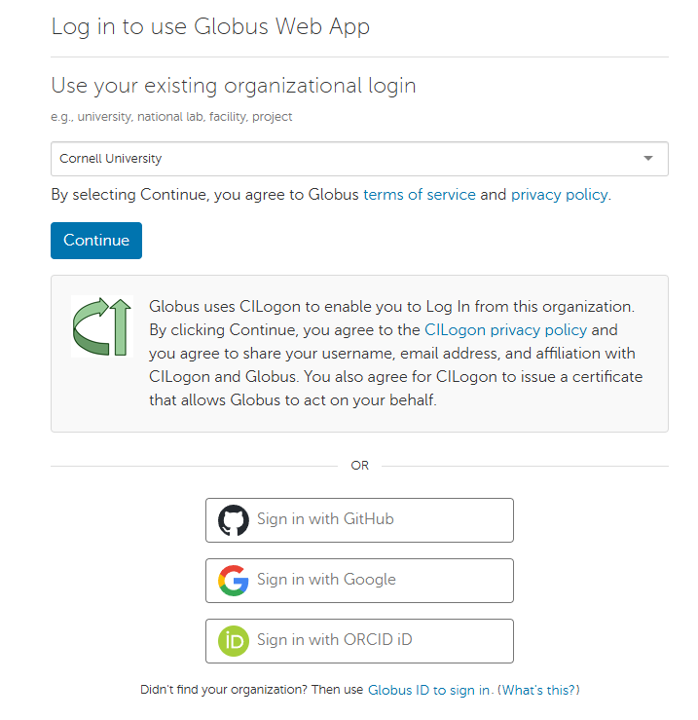
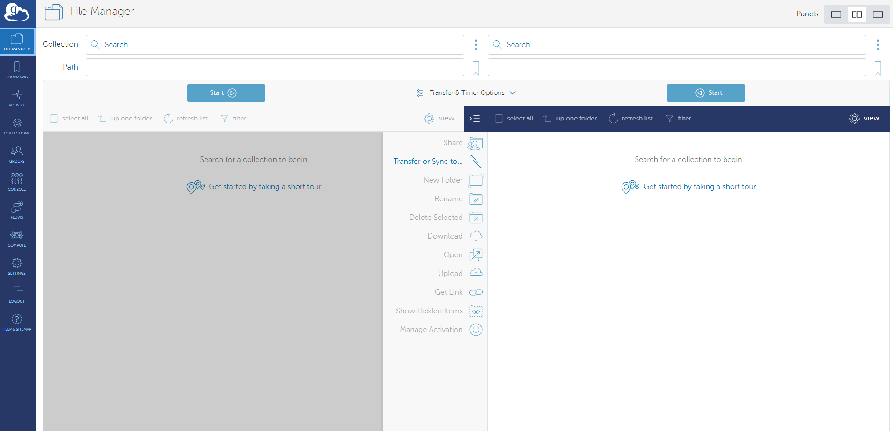
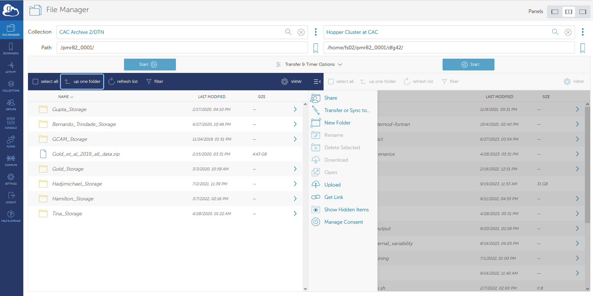

# Long Term Storage 

`Did you know Globus file transfers amounted ot more than 3 exa bytes?`

# Why Globus?

Globus is mainly used for high speed file transfers. Globus allows you to transfer any amount of data effieicntly, securely and reliably.You can share data with collaborrators within or outside your institution. If you are affiliated to Cornell, refer to the CAC TechDocs on [File Transfer using Globus](https://www.cac.cornell.edu/techdocs/files/FileTransferGlobus/). You can also find a virtual workshop [here](https://cvw.cac.cornell.edu/globusxfer)

# How to transfer data with Globus
If you publish a paper and have amassed data that you no longer actively use, but would like to keep in storage, we recommend porting those data into long term storage. The transfer to long term storage is facilitated through [Globus](https://www.globus.org/).

1. First you need to make a Globus account which can made by following the "Log In" tab on the [Globus](https://www.globus.org/) homepage. Cornell affiliated can login using the existing organization login as selected in the image below. You could also login using other options as in with GitHub, Google, ORCID

2. Successfully logging in will take you to the File Manager shown below.

3. The correct path for the Globus endpoint for long term storage is shown in the left box. The "Collection" is "CAC Archive2/DTN" and the path is "/pmr82_0001/". Then, in the left box, if you want to transfer data from Hopper, for example, the "Collection" is "Hopper Cluster at CAC" and the path is "/home/fs02/pmr82_001/yournetid". It's a good idea to make sure that you have your data in a compressed form prior to transfer.   

On some computing systems, Globus endpoint requires an additional setup as defined in this [link](https://docs.globus.org/globus-connect-personal/install/linux/). This requires installation and configuration of Globus Connect Personal. Globus Connect Personal should run in the background on the system to access/transfer your folder/data using [Globus](https://www.globus.org/). This is applicable for your peronal computers. Installation details for Mac and Windows are [here](https://www.globus.org/globus-connect-personal)

4. Then, simply click "start" and wait for the transfer to complete. You can always transfer data back to Hopper if needed. 

Read [this blog post](https://waterprogramming.wordpress.com/2018/09/07/establishing-an-effective-data-backup-strategy-for-your-workstation/) on establishing an effective data backup strategy for your workstation. 