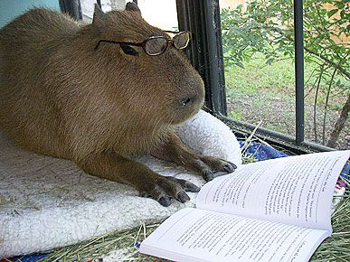

# Writing your first paper
## Supporting materials
Writing your first paper (or any paper for that matter) is never an easy feat. We have put together a [Box folder](https://cornell.app.box.com/folder/212992416831) with some resources that might help give you an idea of what to expect as you embark on this task. Here are brief explanations on the contexts of each folder and their files to speed up your navigation:
1. [Cornell Thesis-Dissertation Template](https://cornell.app.box.com/folder/212992452104?s=clyy6ajqhlhtufu89ur0ddazwgd8r270): Contains the Latex and Word templates for Cornell Masters' Thesis or PhD Dissertation documents.
2. [Journal Submission](https://cornell.app.box.com/folder/215737069086): Contains example documents required for submission to journals, as well as response to reviewers post-submission.
3. [Writing Phases](https://cornell.app.box.com/folder/212992214985): Contains examples of paper sections in the typical order in which they are written. 
4. [Planning Gantt Chart](https://cornell.app.box.com/file/1240425538710): Contains an example of a Gantt chart that may be used to help order writing tasks.

We also have a supporting folder within the Reed Group Box folder called [Dissertations](https://cornell.app.box.com/folder/149476734699?s=x520iu4x0iazeu4siqxro9j7j9d5t1fd) containing current and former members' PhD dissertations.

## Some books on academic writing
1. Strunk, W. J., &amp; White, E. B. (1972). The elements of style. Allyn and Bacon. [Borrow from Cornell Library here.](https://catalog.library.cornell.edu/catalog/6385200)
2. Zinsser, W. (2006). On writing well: The classic guide to writing nonfiction. HarperCollins. [Borrow from Cornell Library here.](https://catalog.library.cornell.edu/catalog/3261133)

Happy writing!

