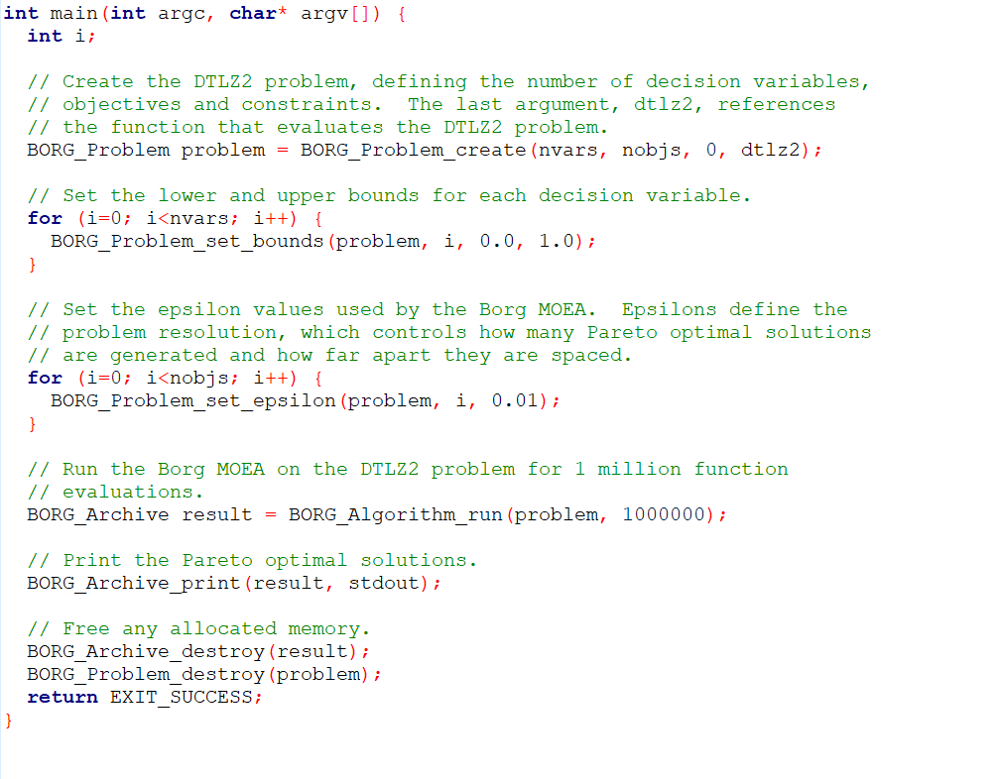

# Introduction to Borg

## Step 1: Reading the Borg Paper 

As you are getting acclimated with the group, one of the tools you will hear a lot about is the Borg Multi-Objective Evolutionary Algorithm (MOEA). The Borg MOEA was developed by Pat and Dave Hadka at Penn State and has become an essential evolutionary algorithm for performing multi-objective optimization in our case studies. The first step to using Borg is to read the associated paper. It's normal to not understand every detail, but as you start working on tutorials through your first semester, you'll find that the paper becomes more understandable and a good resource.   

Download the Paper Here: https://ieeexplore.ieee.org/document/6793867

## Step 2: Basic Borg For Newbies 

On the group blog (https://waterprogramming.wordpress.com/), there are two blog posts that will start you on basic Borg use. Post 1 outlines how to acquire and compile Borg. Post 2 goes through a simple optimization of DTLZ2-3 objectives, a well-behaved mathematical test that has a clearly defined set of solutions.    

Post 1: https://waterprogramming.wordpress.com/2015/06/25/basic-borg-moea-use-for-the-truly-newbies-part-12/

Post 2: https://waterprogramming.wordpress.com/2015/06/25/basic-borg-moea-use-for-the-truly-newbies-part-22/

If you find errors in these posts, please look at the comments at the bottom of the posts that address some issues. 
  

## Take note of the User Guide
In the Borg repository, there is a UserGuide.pdf that can help troubleshoot! Take a look through it. Otherwise, feel free to ask older students in the group. 

## Quiz

It's easy to run Borg but takes effort to understand the inner workings. It's helpful to make sure that you take time periodically to reflect on what you're doing in the training exercises.  

1.	Take a look at the makefile in the Borg folder.

	-	What is a makefile? 
	-	To compile the serial version of borg (borg.c), we are using the GNU compiler, gcc. We use mpicc to compile our parallel versions of borg (borgms.c, borgmm.c). You can explore more of what the GNU variables stand for here: https://www.gnu.org/software/make/manual/html_node/Implicit-Variables.html 
	- Try to outline and identify the sequence of steps that the makefile is executing to create the borg executables. 

2.	Take a look at the test case, dtlz2_serial.c

	-	DTLZ2 is a mathematical test case that can be extended to multiple objectives. The script is currently set to run the 2 objective version, but if you want to run the three objective version, change the number of objectives to 3 and number of variables= number of objectives + 9 for this test case specifically. 
	-	The main function is where the dtlz2 formulation is hooked up to Borg to find the optimal decision variables. Make sure all of this make sense to you because this is how all future problems will be connected to Borg (with slight variations). 

3.	If you are confused as to what specific functions mean, take a look at borg.c and borg.h.

	- As with every C program, there is a .c file and .h file. The .h file contains the definitions of the functions that make up Borg. The .c file contains the actual implementations of the functions. 
	- Search in the borg.c file for BORG_Algorithm_run. What is this function doing? See if you can map out the components of this function, which is driving the whole optimization. 
