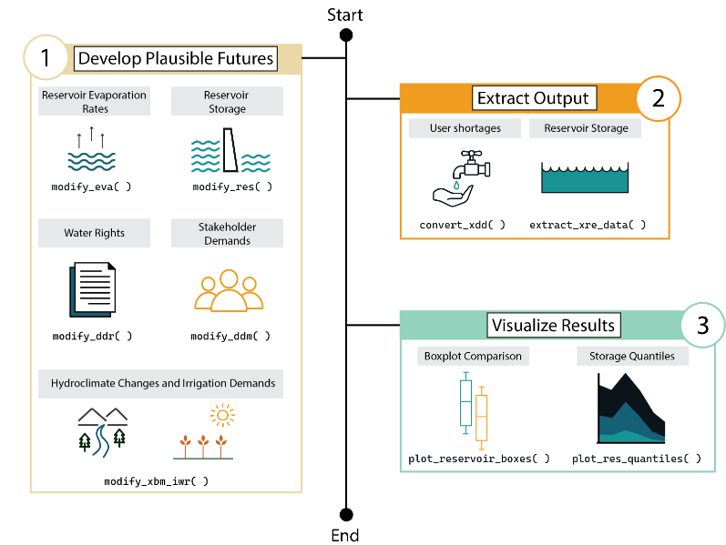

# statemodify

statemodify is a Python package (Gupta et al., 2024) that enables dynamic input modification, ensemble simulation, and streamlined analysis, supporting adaptive planning under uncertainty developed to extend StateMod’s exploratory modeling capacity.

StateMod (State of Colorado’s Stream Simulation Model) is an open-source water-allocation and accounting model developed by Colorado’s Decision Support Systems (CDSS) written in Fortran. StateMod was developed to support comprehensive assessments of water demand and supply by allocating natural streamflows to competing demands based on the Prior Appropriation Doctrine of “first in time, first in right. The adjacent figure illustrates a typical statemodify workflow along with the corresponding functions that can be utilized in each step. This [blog post](https://waterprogramming.wordpress.com/2024/09/09/statemodify-a-python-package-to-explore-drought-vulnerabilities-in-colorados-west-slope/) discusses the functiosn defined in the workflow. 

For more details, see the following paper:

Gupta, R.S., Vernon, C.R., Thurber, T., Gold, D.F., Hirsch, Z.M., Hadjimichael, A. and Reed, P.M., 2024. statemodify: a Python framework to facilitate accessible exploratory modeling for discovering drought vulnerabilities. Journal of Open Source Software, 9(96), p.6325. https://doi.org/10.21105/joss.06325